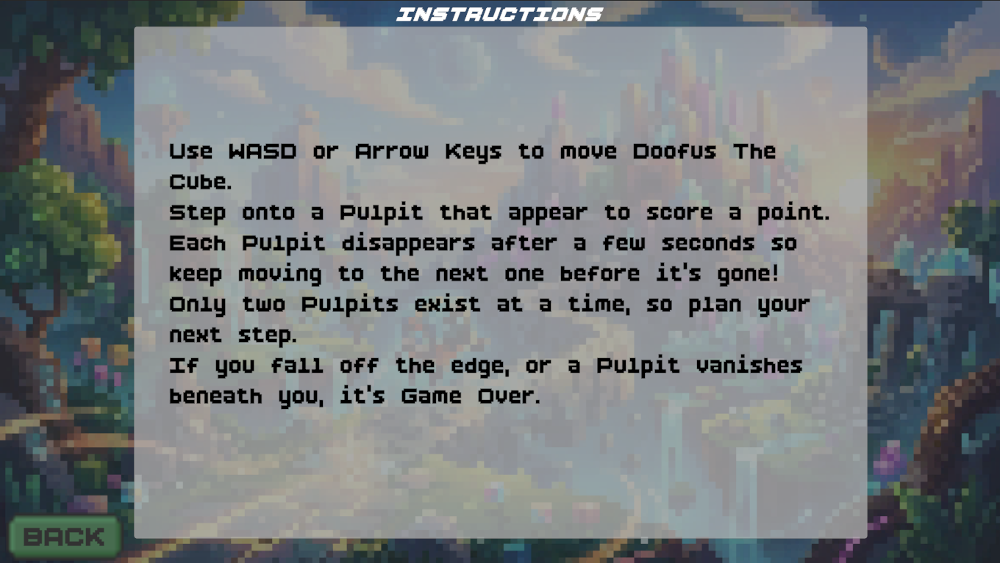
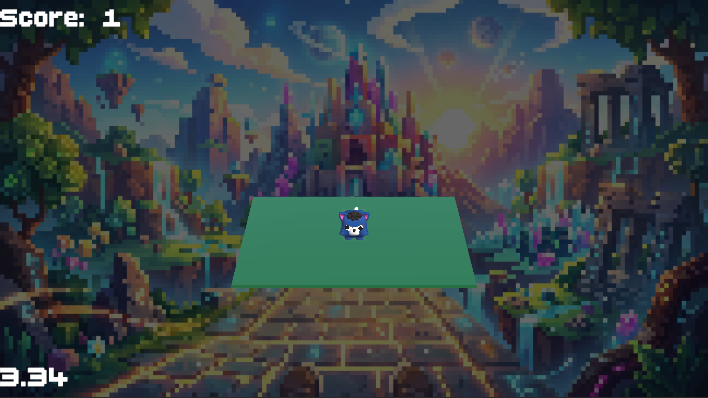
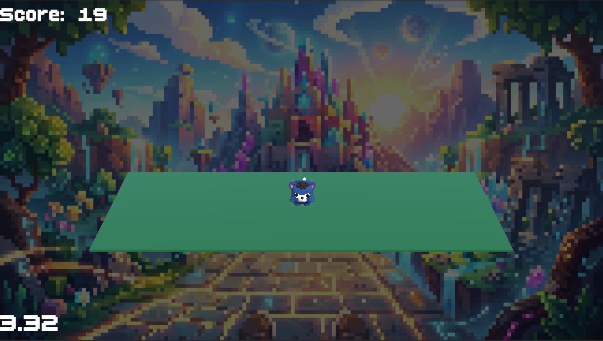
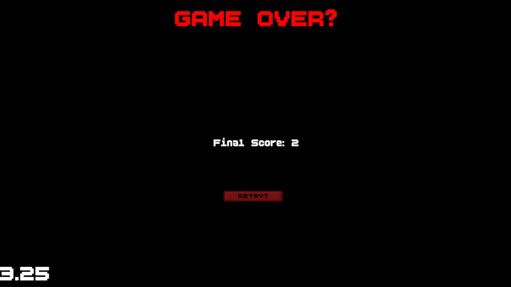

# Doofus Adventure

### Overview
Doofus Adventure is a 3D Unity game built for the Hitwicket Game Developer Challenge.

---
### Requirements / Stack
- Unity 6.5 (6000.5.7f1)

### Controls
- **W / A / S / D** or **Arrow Keys** — Move Doofus (forward, left, backward, right)
---
### Gameplay
- Only **two Pulpits** exist at any given time.
- Each Pulpit has a random lifetime (between a min and max value defined in the config). Once its timer runs out, the Pulpit disappears — if Doofus is still standing on it, the game ends.
- A new Pulpit spawns adjacent to the current one once the active Pulpit's remaining time drops to a set trigger value, so there's always a next step available in advance.
- The current Pulpit's remaining time is shown live on the on-screen timer while Doofus stands on it.
- **Score** increases by one every time Doofus lands on a **new, distinct** Pulpit — standing on the same one repeatedly doesn't add extra points.
- Walking off the edge, or a Pulpit expiring underneath Doofus, ends the game and shows the final score on the Game Over screen.
---
###  How to Run
1. Open the project in Unity.
2. Open the `MainMenu` scene.
3. Press Play, then click the Play button in the scene to start the game.
---
### Completed Levels
- Level 1 ✓ — Character movement and Pulpit placement read from JSON
- Level 2 ✓ — Score updates on every successful move to a different Pulpit
- Level 3 ✓ — Start Screen and Game Over Screen

## Gameplay Video

## Screenshots

 
 

